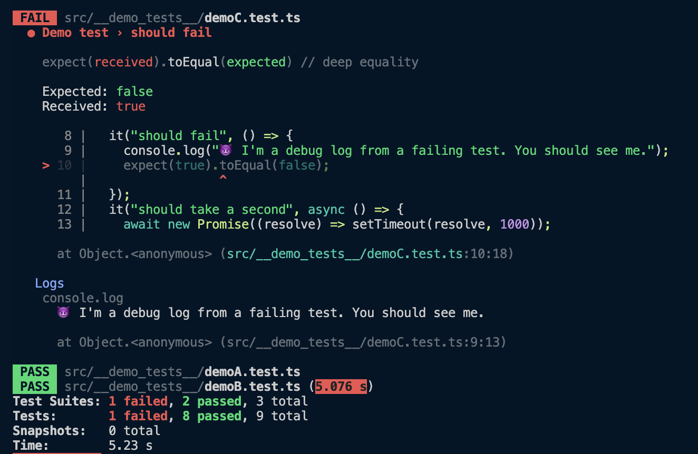

# jest-quiet-reporter



All the Jest reporters [out there](https://github.com/jest-community/awesome-jest/tree/02e5ca32a254fdc708d2ce0cb983ad572136ec7f?tab=readme-ov-file#reporters) are either silent or noisy.

`jest-quiet-reporter` is a twist on the built-in [Default Reporter](https://github.com/jestjs/jest/blob/main/packages/jest-reporters/src/DefaultReporter.ts).

**For passing tests, it only outputs "PASS" with the test path and the time. But for failing tests, it shows you the STDOUT and STDERR logs produced during the tests.** Now you can `console.log` to your heart's content and only see it when you need it.

## Usage

Install:

```
pnpm add -D jest-quiet-reporter
```

Jest CLI:

```
jest --reporters=jest-quiet-reporter
```

Jest configuration file:

```
{
  "reporters": ["jest-quiet-reporter"]
}
```

